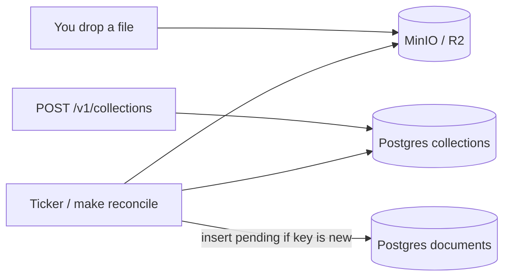
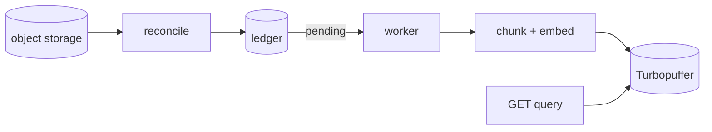

# RiftDB

Object storage is the source of truth. RiftDB watches a collection prefix and records what it sees. The vector index is the eventual destination. It is not a search engine yet.

## Now



A collection is a watch spec (`source_prefix`, embedding model, namespace). Every `RECONCILE_INTERVAL` (default 30s) the API lists that prefix and inserts a `documents` row when the key is missing. A unique index on `(collection_id, r2_key)` stops duplicates.

`POST /v1/collections/{id}/documents` still exists. Discovery does not use it.

## Later



Download, chunk, embed, upsert, and query are not wired.

## Run

```bash
cp .env.example .env
docker compose up -d postgres minio minio-init
make run
```

API: `http://localhost:8080`  
MinIO console: `http://localhost:9001` (user `riftdb` / `riftdbsecret`)

```bash
curl -sS -X POST localhost:8080/v1/collections \
  -H 'Content-Type: application/json' \
  -d '{"name":"papers"}'

# put an object at collections/papers/notes.txt in bucket riftdb
make reconcile
curl -sS localhost:8080/v1/collections
```

`make list-prefix` lists MinIO. `make migrate` applies SQL if the volume is old.

Redis is in compose for Asynq. Nothing enqueues yet. Port 6379 / 8080 conflicts are host problems, not app bugs.

## Layout

| Path | Role |
| --- | --- |
| `cmd/api` | HTTP + reconcile loop |
| `cmd/reconcile` | one-shot discovery |
| `cmd/s3list` | list a prefix |
| `internal/reconcile` | diff prefix vs ledger |
| `internal/storage` | S3 + in-memory |
| `migrations/` | Postgres |
